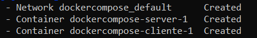
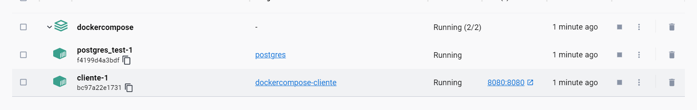
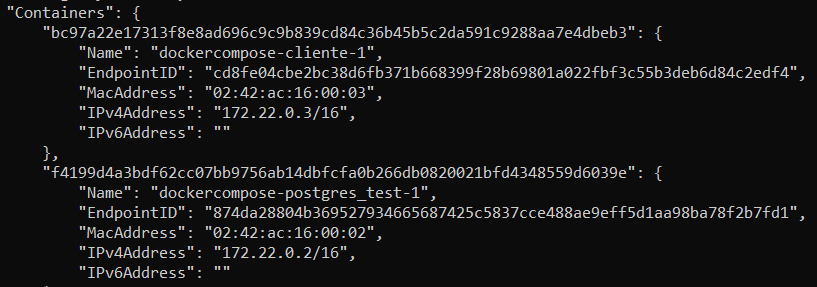

# Prueba Sobre el Uso De Docker Compose
El programa base que utilizaremos es el que se realizó en el bloque 7, crud validation y como material base realizaremos la misma conexión que en el ejercicio block10-dockerize-app, pero esta vez aprovechandonos de la automatización que nos ofrece Docker Compose, por lo que para consultas como podrían ser como se ha realizado la configuración de la conexión a la base de datos en nuestra aplicación, deberemos consultar dicho material.

Esta carpeta contiene los elementos necesarios para realizar una prueba sobre el uso de docker Compose. Disponemos de:
- Un archivo ejecutable jar ya compilado preparado para generar la imagen docker
- Un archivo dockerfile preparado para generar la imagen docker
- Un archivo docker compose ya preparado para utilizar con nuestro ejecutable y nuestro dockerfile

## Comandos Docker
Para levantar nuestro sistema dockerizado solo tenemos que utilizar el comando (dentro de nuestro directorio con nuestro archivos)

> docker compose up

Podemos ver que esto nos genera nuestra red y nuestros contenedores (Ademas de nuestra imagen que hemos especificado construya en nuestro archivo yml)

También cabe mencionar que el nombre de proyecto de docker va a ser el nombre del directorio donde tengamos los archivos, como podemos ver en la siguiente captura, donde se nos muestra como nuestros contenedores ambos están bajo el nombre de proyecto DockerCompose 

Si queremos especificar un nombre de proyecto propio lo podemos hacer con la opción -p 

> docker compose -p miproyecto up

También podemos comprobar que en efecto ambos contenedores están incluidos en la red que se ha creado con el comando

> docker inspect dockercompose_default

En este ejemplo particular podemos probar el correcto funcionamiento realizando una petición get a localhost:8080/student

Cuando queramos terminar nuestra prueba y desmontarlo todo solo tenemos que utilizar

> docker compose down

Y el mismo docker se ocupa de detener y eliminar todo lo que se ha levantado (Excepto la imagen, la cual se conserva)